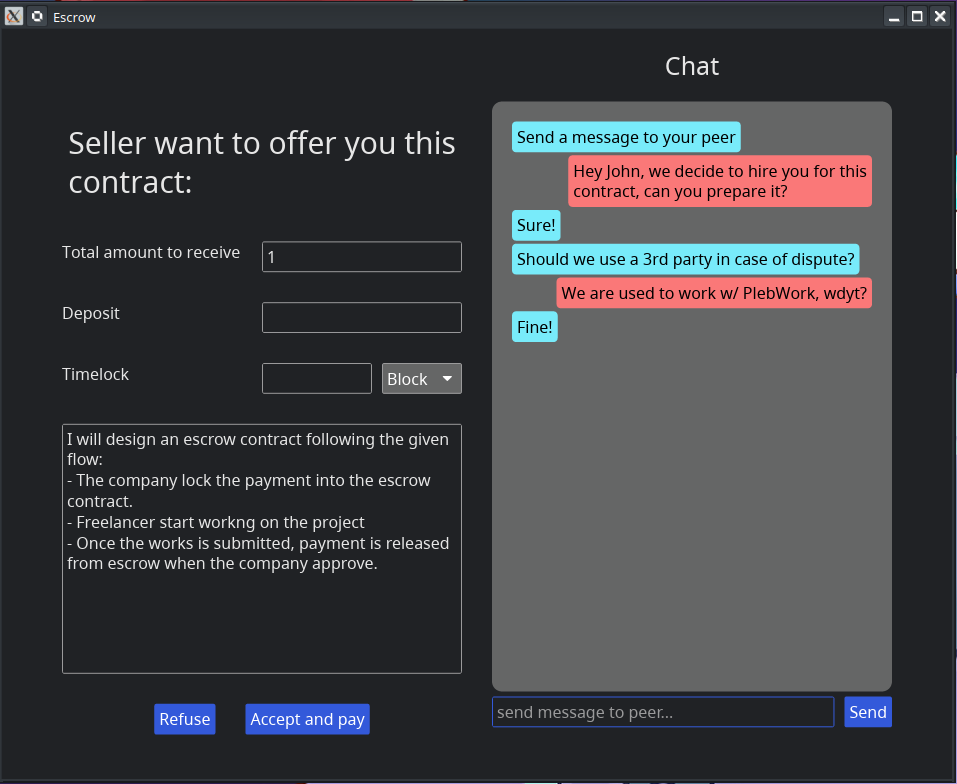

# Escrow



This project is an experimental Bitcoin wallet designed to interact with peer-to-peer escrow contracts using Miniscript and Taproot.

# Features

 - Single Purpose: Designed specifically for escrow contracts.
 - Self Custody: You control your cryptographic secrets.
 - Trustless: No reliance on third-party acknowledgments.
 - Peer-to-Peer: Contracts are not hosted or executed by a central coordinator.
 - Secure: Utilizes Bitcoin Miniscript and Taproot for security.

## Details

For more details you can have a look at the [design choices](/docs/DESIGN_CHOICES.md).

# Build

Install Rust toolchain ([see here](https://www.rust-lang.org/tools/install))

and run this from this repo:

```shell
cargo run --release
```

# TODOs:

- [x] normal spending flow (w/o dispute)
- [ ] recovery/dispute flow
- [ ] deposit feature
- [ ] timelock feature
- [ ] bitcoin backend (bdk?)
- [ ] signing devices suport
- [ ] doc
- [ ] tests
- [ ] cli options (nostr relay)
- [ ] API
- [ ] Bindings
